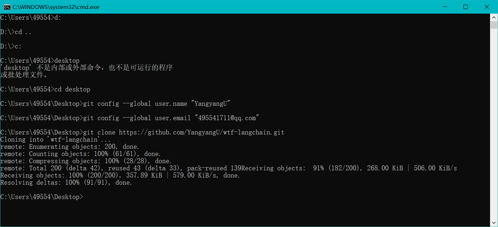

# LangChain

- 目前用的最多的AI框架
    getCompletion 封装方法 调用接口
- 现在用的最多的AI框架
    标准化LLM 开发流程
    简化LLM开发
    LLM 随时换模型

- 开发AI应用
    更多聚焦于业务，快速开发

- 聊天工具 业务

- 如何向开源项目提交代码

零时拉项目到桌面

    - fork 大佬的项目
        自己的仓库，有提交和修改权限
    - 发现了大佬的bug 或他要我们做的job
        把活干完，完成测试
        add commit push
    - 提交到我们自己的远程仓库
    - 点进这次提交 create pull request
        描述问题，怎么解决的 截图，提交
    - 大佬就会收到消息，检查，没用问题，merge