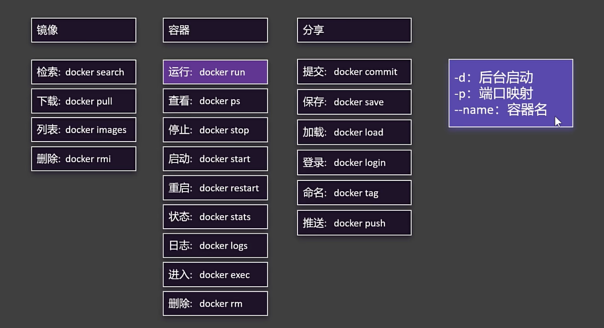
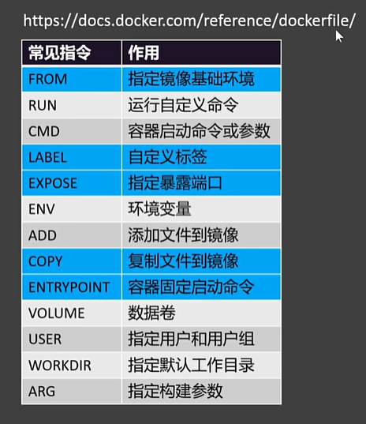

- https://www.bilibili.com/video/BV1Zn4y1X7AZ?p=7&spm_id_from=pageDriver&vd_source=5f9f9d999e4a2613e4893f0be1684f97

# Docker安装

## 卸载docker
```bash
sudo yum remove docker \
                  docker-client \
                  docker-client-latest \
                  docker-common \
                  docker-latest \
                  docker-latest-logrotate \
                  docker-logrotate \
                  docker-engine
```

## 配置阿里云镜像
```bash
sudo yum install -y yum-utils
sudo yum-config-manager --add-repo https://mirrors.aliyun.com/docker-ce/linux/centos/docker-ce.repo
```

## docker engine
```bash
sudo yum install docker-ce docker-ce-cli containerd.io docker-buildx-plugin docker-compose-plugin
```

## start docker
```bash
sudo systemctl start docker
```


## 查看运行中的应用
```bash
docker ps
```

## docker 开机自启
```bash
sudo systemctl enable docker
```

## 配置加速器
```bash
sudo mkdir -p /etc/docker
sudo tee /etc/docker/daemon.json <<-'EOF'
{
  "registry-mirrors": ["https://ccr.ccs.tencentyun.com"]
}
EOF
sudo systemctl daemon-reload
sudo systemctl restart docker
```

# Docker使用

## 搜索镜像
```bash
docker search nginx
```

## 拉取镜像 接镜像名和版本
```bash
docker pull nginx:1.21.6
```

[dockerhub](https://hub.docker.com/)

## 拉取镜像 直接接镜像名
```bash
docker pull nginx
```

## 查看本地镜像
```bash
docker images
```




## 运行镜像
```bash
docker run nginx
docker run -d nginx # 后台运行
docker run -p 88:80 nginx # 端口映射 本机88:80容器
docker run -d --name mynginx nginx # 后台运行
```

## 进入容器
```bash
docker exec -it mynginx bash

cd usr/share/nginx/html
```

## 挂载目录
```bash
docker run -d -p 88:80 -v /app/nghtml:/usr/share/nginx/html --name mynginx nginx # 挂载目录
```

## 卷映射

映射配置文件时，初始配置文件为空，导致无法启动

```bash
docker run -d -p 88:80 -v /app/nghtml:/usr/share/nginx/html -v ngconf:/etc/nginx --name mynginx nginx # 挂载目录
```

不以`/`或`./`开头的被归为卷

存放地址`/var/lib/docker/volumes/<volume-name>`

## Dockerfile



```bash
上传tar文件到服务区

- 解压 
tar -xvf xxxx.tar

- 移除压缩包
rm -rf xxxx.tar

- 打包镜像
docker build -f Dockerfile -t xxxxx:1.0.0 .

- 查看镜像
docker images

- 运行容器
docker run -d -p 8888:80 xxxxx:1.0.0


```
