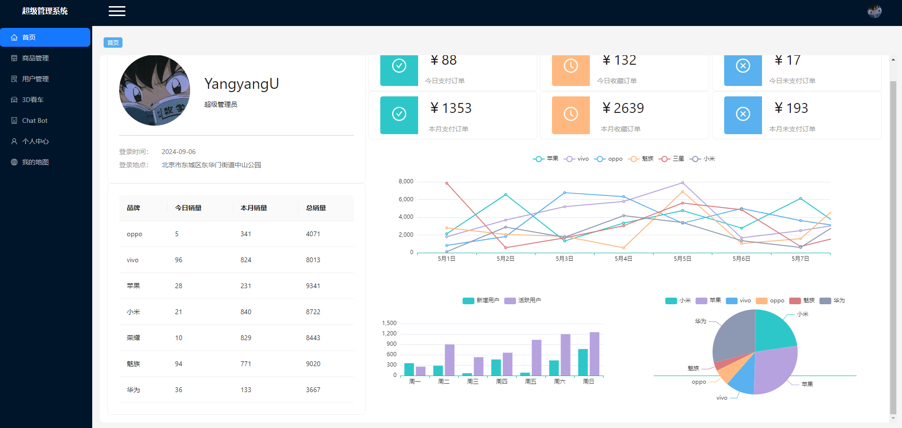
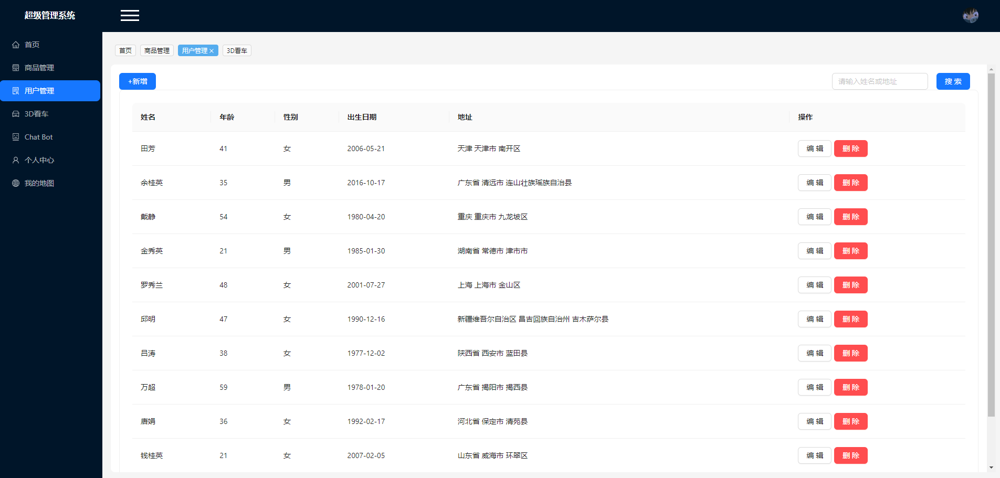
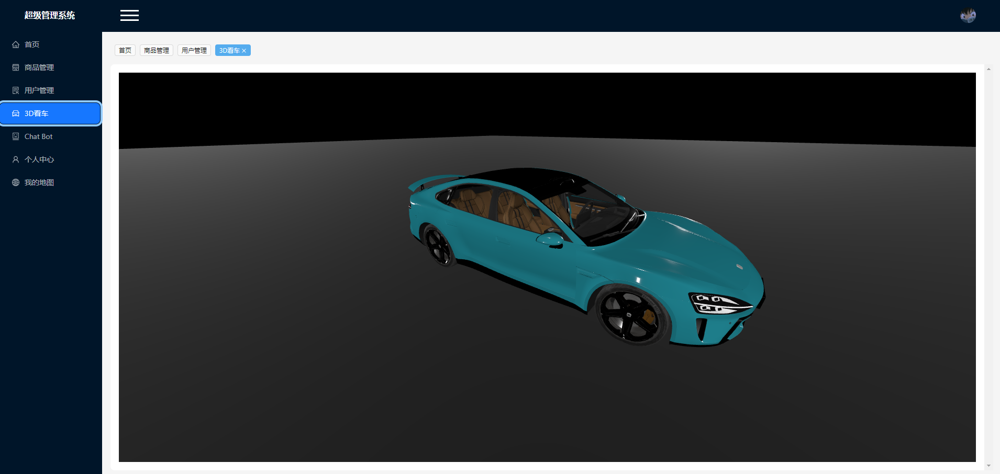
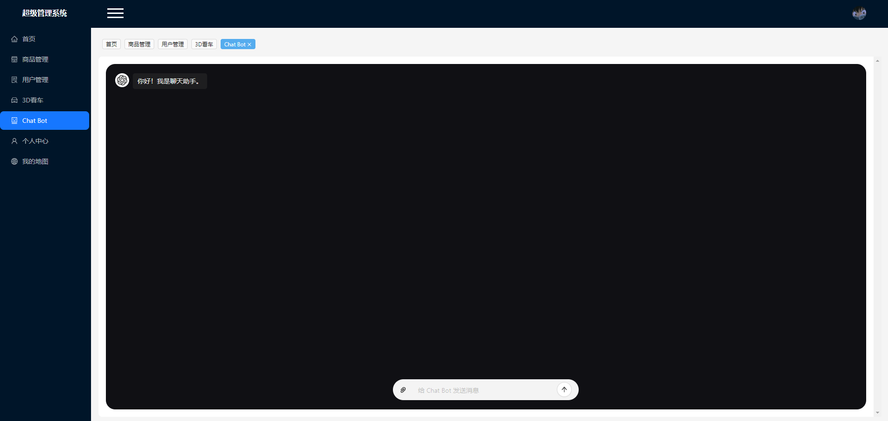
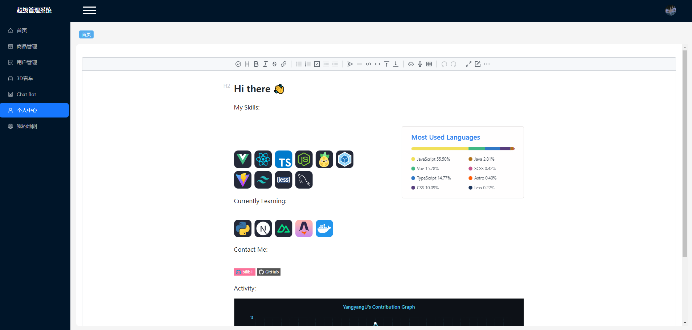
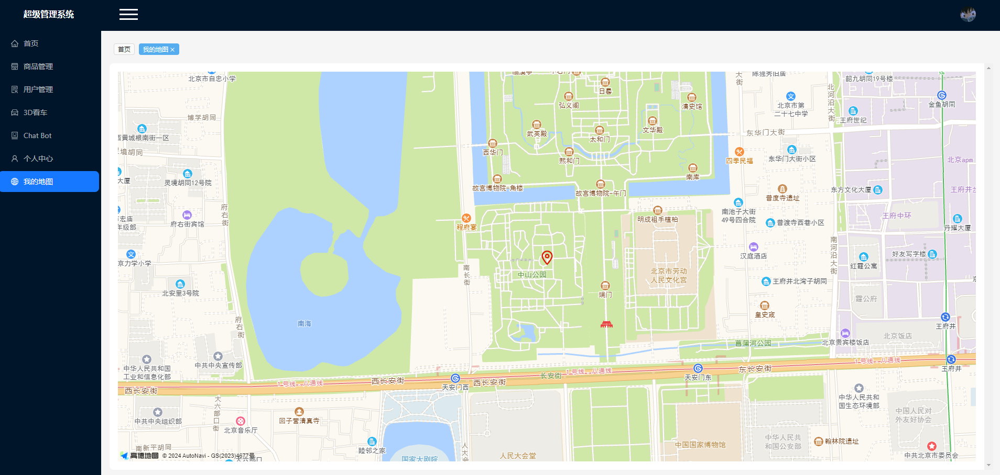

# 超级管理系统

## 作者

```
YangyangU
```

## 技术栈

<p align="left">
  <a href="https://skillicons.dev">
    
  </a>
</p>

## 项目运行

```
git clone https://github.com/zhengyuxiang/my-back-system-react.git
cd my-back-system-react
npm install
npm run start
```

### 账号

```
admin
```

### 密码

```
admin
```

## 项目截图

**首页**


**商品管理**


**用户管理**


**3D看车**


**Chat Bot**


**个人中心**


**我的地图**

