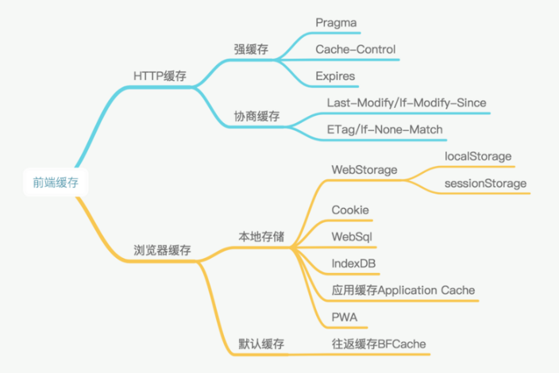

## cookie

- HttpOnly -  JS读不到cookie 防范XSS攻击
- Secure - 只应通过被 HTTPS 协议加密过的请求发送给服务端
- Expires - 被删除的时间戳
- Max-Age - 存活时间
- Path - 限制访问路径
- Domain - 限制访问域名
- SameSite - 限制第三方Cookie的发送 防范CSRF
   - strict：仅允许一方请求携带 Cookie，即浏览器将只发送相同站点请求的 Cookie，即当前网页 URL 与请求目标 URL 完全一致。
   - lax：允许部分第三方请求携带 Cookie
   - none：无论是否跨站都会发送 Cookie

- Cookie 主要用于以下三个方面：

   - 会话状态管理（如用户登录状态、购物车、游戏分数或其它需要记录的信息）
   - 个性化设置（如用户自定义设置、主题等）
   - 浏览器行为跟踪（如跟踪分析用户行为等）

## localStorage

- 始终有效，窗口或浏览器关闭也一直保存，本地存储，因此用作持久数据
- 在所有同源窗口中都是共享的；也就是说只要浏览器不关闭，数据仍然存在

- ## sessionStorage

- 仅在当前浏览器窗口关闭之前有效
- 不在不同的浏览器窗口中共享，即使是同一个页面