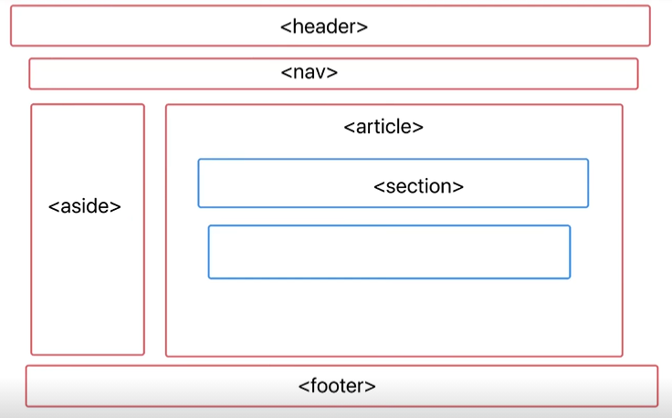

# 自我介绍
姓名 + 学校 + 做过什么 + 有过什么成绩 + 为什么能胜任
面试官您好，我叫徐阳阳，目前就读于东华理工大学，主修软件工程专业，在学校担任心理委员，班级排名前二十，对前端比较感兴趣，阅读过前端黄皮书跟红宝书，在掘金分享一些自己记录学习的文章，leetcode也刷了180多道，有一定的算法基础，平常也会逛逛Github，找一些有趣的开源项目，看看源码什么的，然后目前在关注AI方面的内容。然后听XX的学长说XX的很多部门在接入AI，所以我很想加入，与大家一起学习，共同进步！

# 1. 数组上的方法，在js中的意义
var a = []
a.push()
a.pop()

1. 创建对象字面两在V8的执行过程中相当于new了一个构造函数，通常我们不去直接new这种写法，因为不够简洁直观
2. 因为a相当于是new Array()得到的，那么a的隐式原型等于构造函数的显式原型，V8在查找属性时会先查找对象上的属性，找不到就会顺着原型链网上找。

new的实现原理：
function myNew(Fn){
    let obj = {} 创建一个新对象
    obj.__proto__ = Fn.prototype 然后将obj的隐式原型指向Fn的显示原型原型
    Fn.call(obj) 触发Fn，并将this指向obj ，让实例对象能够具有构造函数的属性和方法
    return obj
}
myNew(Person)

添加元素：
- arr.push()
- arr.unshift()
- arr.splice()
删除元素：
- arr.pop()
- arr.shift()
- arr.splice()
其他：
- arr.slice()
- arr.join()
- arr.reserve
- arr.indexOf
- arr.includes()
- arr.sort()
- arr.filter()
- arr.reduce()
- arr.map()
- arr.find()
- arr.every()
- arr.some()

# 2. promise有几种状态？可以重复改变吗？
1. 三种 pending fulfilled rejected
2. 红绿灯算法

# 3. 输出结果
== 与 ===

# 4. 聊聊你对语义化的理解？
- 有哪些

- <header>
- <nav>
- <aside>
- <article>
- <section>
- <footer>
- 优点：可读性好，SEO优化，更好地支持各种终端

# 5. 斐波那契数列

# 6. 用过什么AI工具
1. chatgpt （可以联系prompt技巧，生成简单的前端页面，文章）
2. Copilot、Tabnine AI、通义灵码  提升开发效率
3. LangChain
4. 自己准备一个大模型，介绍你对它的理解

# 7. 讲一讲HTTP请求的三次握手
    - 三次握手是TCP协议建立连接是产生的
    1. 客户端发送连接请求到服务端，客户端状态进入 SYN-SENT 状态
    2. 服务端接收到请求连接报文后，返回一个应答（包含ACK序号），服务端进入SYN-RECEIVED状态
    3. 客户端接收到了同意连接的应答后，还要向服务端发送一个确认收到的报文。再进入 ESTABLISHED 状态

    - 为什么一定要三次握手，两次行不行？
    不行，假设客户端给服务端发送了一个建立请求连接A，但是因为网络环境差，这个请求A超时了，那么TCP会启动超时重传机制，再发送一个新的建立连接请求B，服务端接收到B请求后应答，如果此时就完成了建立连接的话，当客户端和服务端通信完成后，便释放了连接，双方都进入Closed状态。假设此时A请求又抵达了服务器，那么服务端会认为客户端又要建立新的连接从而答应该请求并进入ESTABLISHED状态，而此时客户端是Closed状态，那么服务端就会一直等待，造成资源浪费。

    - 四次挥手
    1. 客户端A认为数据发送完成，向服务端B发送释放连接请求
    2. B收到释放连接请求后，返回一个ACK报文，并进入CLOSE-WAIT 状态，此时不再接收A发送的数据，但是B人可以给A发送数据
    3. B如果此时还有没发完的数据，就会继续发送，发完后向A发送释放连接的请求，B进入到LAST-ACK状态
    4. A收到释放连接的请求，向B发送应答，进入CLOSED状态，B接收到该应答也进入CLOSED状态

# 8. 说一说跨域
https://192.168.31.45:8080/user
协议号:域名:端口号/路径

- 同源策略：协议号-域名-端口号 都相同的地址，浏览器才认为是同源

- 跨域：后端返回给浏览器的数据被浏览器的同源策略给拦截下来

- 同源策略的目的是数据安全
 
## 解决跨域
1. JSONP --- 借助script标签上的src属性不受同源策略的影响这一机制，来实现跨域

    (1). ajax请求受同源策略的影响，但是`<script>`上的src属性不受同源策略的影响，且该属性也会导致浏览器发送一个请求
    1. 借助script的src属性给后端发送一个请求，并且携带一个参数('callback')
    2. 前端在window添加了一个callback函数
    3. 后端接收到这个参数'callback'后，将返回给前端的数据data和这个'callback'进行拼接，成'callback(data)'并返回
    4. 因为window上已经有一个callback函数，后端又返回一个形如'callback(data)'，浏览器会将该字符串执行成callback的调用

    (2). 缺点
    1. 必须要后端配合
    2. 只能做get请求

2. CORS（Cross-Origin Resource Sharing）--- 后端通过设置响应头来告诉浏览器不要拒接接受后端的响应
设置响应头，给出白名单

3. node 代理
vite帮我们启动了一个node服务，且帮我们朝'http://localhost:3000'发起请求，因为后端没有同源策略
所以，vite中的node服务能直接请求到数据，再提供给前端使用

缺点：只在vite开发环境中生效

4. nginx 代理
类似cors，配置白名单，生产环境下常用

5. domain
在iframe中，当父级页面和子级页面的子域不同时，通过设置document.domain='xx'来将xx定位基础域，从而实现跨域

6. postMessage
在iframe中，当父级页面和子级页面的子域不同时